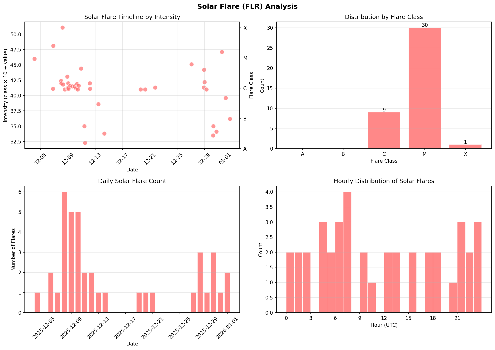
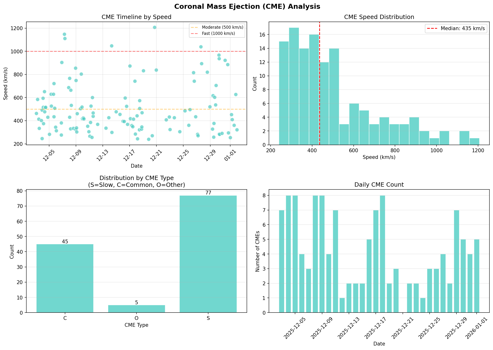
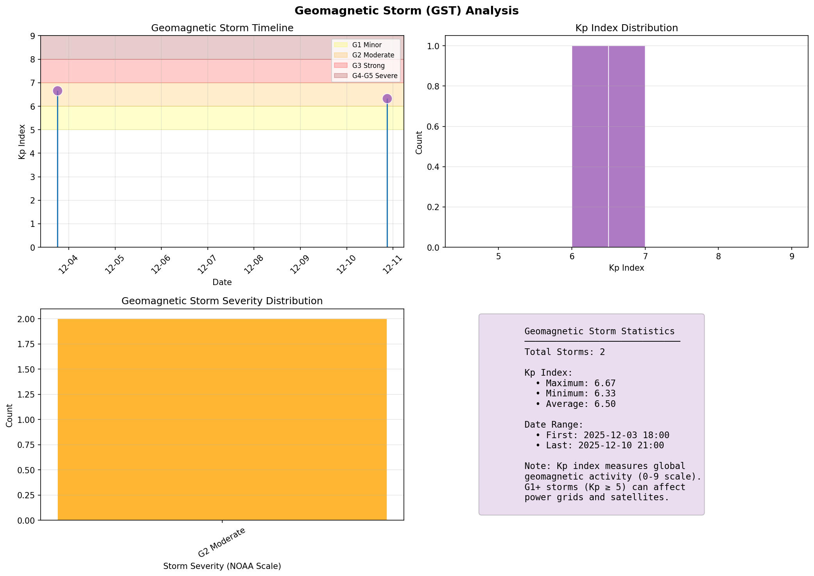
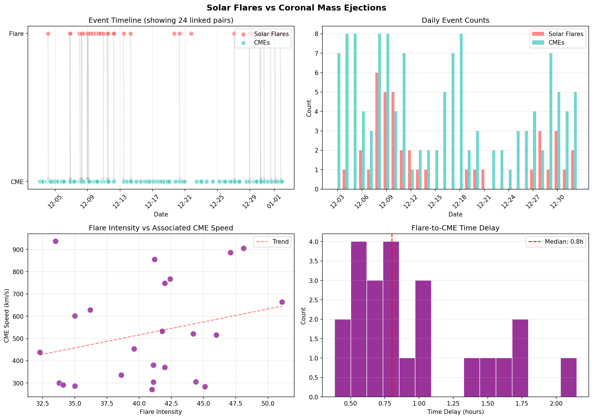
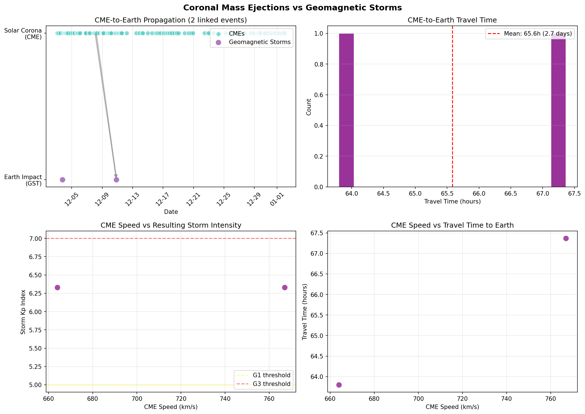
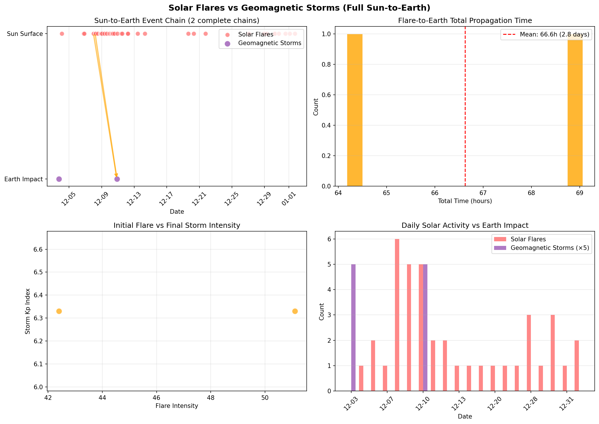

# NASA Space Weather Timeline

Visualizes the relationship between solar events and their Earth impact using NASA's DONKI (Space Weather Database Of Notifications, Knowledge, Information) API.

## Overview

This tool fetches three types of space weather events and plots them on a timeline:

- **Solar Flares (FLR)** - Sudden eruptions on the Sun's surface
- **Coronal Mass Ejections (CME)** - Massive plasma ejections from the solar corona
- **Geomagnetic Storms (GST)** - Disturbances in Earth's magnetosphere caused by CMEs

The timeline visualization shows the propagation delay between solar explosions and when they impact Earth (typically 1-4 days).

## Installation

Using [uv](https://docs.astral.sh/uv/):

```bash
uv sync
```

Or run directly without installing:

```bash
uv run space_weather_timeline.py
```

## Usage

```bash
# Run with uv
uv run space_weather_timeline.py

# Or if you've synced dependencies
uv run python space_weather_timeline.py
```

The script fetches the last 30 days of space weather data and generates multiple visualizations.

## Generated Charts

### 1. Combined Timeline (`space_weather_timeline.png`)


Shows all three event types on a single timeline with propagation arrows showing linked events and travel times.

### 2. Individual Event Charts

#### Solar Flares (`chart_flares.png`)


- Timeline by intensity
- Distribution by flare class (A, B, C, M, X)
- Daily flare count
- Hourly distribution

#### Coronal Mass Ejections (`chart_cme.png`)


- Timeline by speed with reference lines (500 km/s moderate, 1000 km/s fast)
- Speed distribution histogram
- Distribution by CME type (S=Slow, C=Common, O=Other)
- Daily CME count

#### Geomagnetic Storms (`chart_gst.png`)


- Timeline with Kp index and NOAA storm scale bands
- Kp index distribution
- Storm severity classification (G1-G5)
- Summary statistics

### 3. Pairwise Comparison Charts

#### Flares vs CMEs (`chart_flr_vs_cme.png`)


- Dual timeline with linked event connections
- Daily count comparison
- Flare intensity vs associated CME speed
- Flare-to-CME time delay distribution

#### CMEs vs Geomagnetic Storms (`chart_cme_vs_gst.png`)


- CME-to-Earth propagation timeline
- Travel time distribution (typically 1-4 days)
- CME speed vs resulting storm intensity
- CME speed vs travel time

#### Flares vs Storms - Full Chain (`chart_flr_vs_gst.png`)


- Complete Sun-to-Earth event chain visualization
- Total propagation time distribution
- Initial flare intensity vs final storm Kp index
- Daily solar activity vs Earth impact

## API

Uses NASA's DONKI API (free, no authentication required for demo):
- https://api.nasa.gov/DONKI/FLR - Solar Flares
- https://api.nasa.gov/DONKI/CME - Coronal Mass Ejections
- https://api.nasa.gov/DONKI/GST - Geomagnetic Storms

For higher rate limits, get an API key at https://api.nasa.gov/

## Understanding the Data

| Event | Location | Measure | Impact |
|-------|----------|---------|--------|
| Solar Flare | Sun's surface | Class (A,B,C,M,X) | Radio blackouts |
| CME | Solar corona | Speed (km/s) | Plasma traveling to Earth |
| Geomagnetic Storm | Earth's magnetosphere | Kp index (0-9) | Power grid/satellite effects |

**NOAA Geomagnetic Storm Scale:**
- G1 (Kp=5): Minor - weak power grid fluctuations
- G2 (Kp=6): Moderate - voltage alarms in power systems
- G3 (Kp=7): Strong - intermittent satellite navigation issues
- G4 (Kp=8): Severe - widespread voltage control problems
- G5 (Kp=9): Extreme - complete power grid collapse possible
