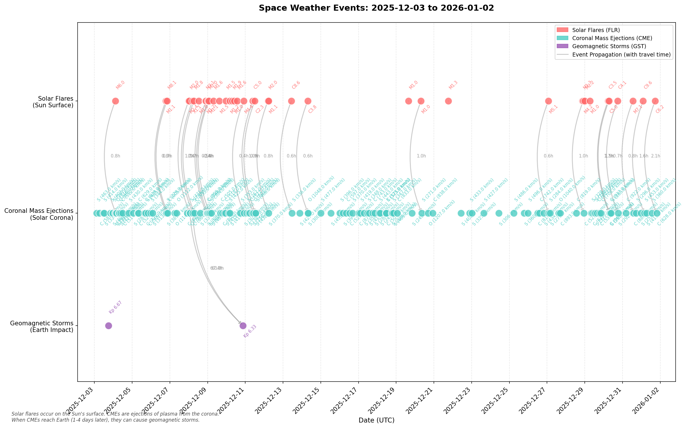

# NASA Space Weather Timeline

Visualizes the relationship between solar events and their Earth impact using NASA's DONKI (Space Weather Database Of Notifications, Knowledge, Information) API.

## Overview

This tool fetches three types of space weather events and plots them on a timeline:

- **Solar Flares (FLR)** - Sudden eruptions on the Sun's surface
- **Coronal Mass Ejections (CME)** - Massive plasma ejections from the solar corona
- **Geomagnetic Storms (GST)** - Disturbances in Earth's magnetosphere caused by CMEs

The timeline visualization shows the propagation delay between solar explosions and when they impact Earth (typically 1-4 days).

## Sample Output



## Installation

```bash
pip install -r requirements.txt
```

## Usage

```bash
python space_weather_timeline.py
```

The script fetches the last 30 days of space weather data and generates:
- A summary of all events in the console
- A timeline chart saved as `space_weather_timeline.png`

## API

Uses NASA's DONKI API (free, no authentication required for demo):
- https://api.nasa.gov/DONKI/FLR - Solar Flares
- https://api.nasa.gov/DONKI/CME - Coronal Mass Ejections
- https://api.nasa.gov/DONKI/GST - Geomagnetic Storms

For higher rate limits, get an API key at https://api.nasa.gov/

## Understanding the Chart

- **Top row (red)**: Solar flares with their intensity class (e.g., M6.0, X2.0)
- **Middle row (teal)**: CMEs with type and speed (e.g., S 463 km/s)
- **Bottom row (purple)**: Geomagnetic storms with Kp index
- **Connecting arrows**: Show linked events and travel time in hours
